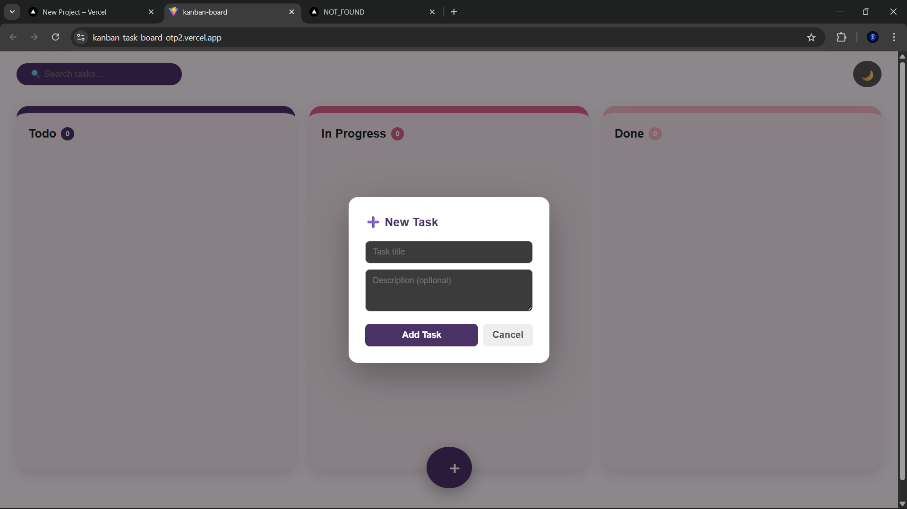
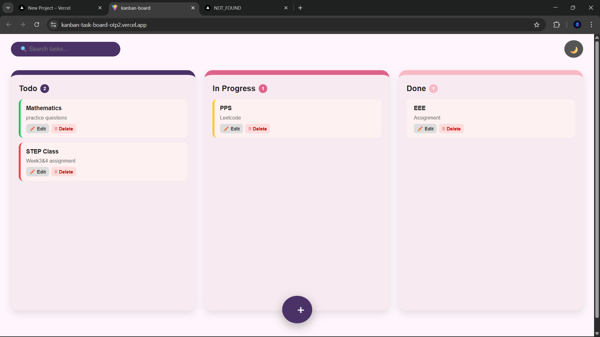
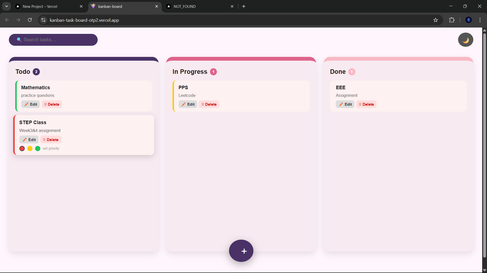
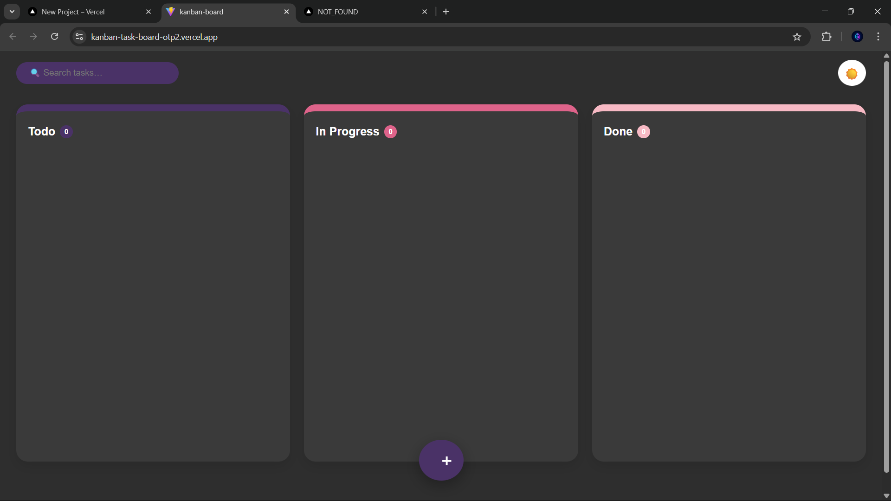

# Kanban Task Management Application

A **Kanban-style task management web application** built using **React, JavaScript, HTML, and CSS**.
The application allows users to organize tasks across different workflow stages using a visual Kanban board.

**LIVE LINK FOR THE APP->**https://kanban-task-board-otp2.vercel.app/

---

## 🚀 Features

* **Task Creation** – Add tasks with title and optional description
* **Drag & Drop** – Move tasks between workflow columns
* **Task Editing** – Update task title and description
* **Task Deletion** – Remove tasks from the board
* **Priority Labels** – Assign High, Medium, or Low priority
* **Search Functionality** – Filter tasks using the search bar
* **Dark Mode Toggle** – Switch between light and dark themes
* **Local Storage Persistence** – Tasks remain after page refresh
* **Responsive Design** – Works on desktop and mobile screens

---

## 📋 Workflow Columns

The Kanban board contains three main workflow stages:

* **Todo**
* **In Progress**
* **Done**

Tasks can be dragged between these columns to represent progress.

---

## 🛠️ Technologies Used

* **React**
* **JavaScript (ES6+)**
* **HTML5**
* **CSS3**
* **Vite**
* **Local Storage API**

---

## 📂 Project Structure

```
kanban-task-board
│
├── public
│   └── vite.svg
│
├── src
│   ├── App.jsx
│   ├── App.css
│   ├── main.jsx
│   └── assets
│
├── index.html
├── package.json
├── vite.config.js
└── README.md
```

---

## ⚙️ Installation and Setup

1. **Clone the repository**

```
git clone https://github.com/YOURUSERNAME/kanban-task-board.git
```

2. **Navigate to the project directory**

```
cd kanban-task-board
```

3. **Install dependencies**

```
npm install
```

4. **Run the development server**

```
npm run dev
```

5. **Open the application**

```
http://localhost:5173
```

---

## 🌐 Deployment

The application is deployed using **Vercel**.

Live Demo:

```
https://your-project-link.vercel.app
```

---

## 🧪 Testing

The application was tested for:

* Task creation
* Task editing and deletion
* Drag-and-drop functionality
* Data persistence after page refresh
* Responsive layout on different screen sizes

---

## Application Screenshots

### Main Kanban Board Interface
The dashboard showing the three workflow columns: **Todo, In Progress, and Done**.


---

### Creating a New Task
A popup modal that allows users to enter a **task title and optional description**.



---

### Task Management and Workflow Tracking
Tasks can be dragged between columns to represent workflow progress.



---

### Setting Task Priority
Users can assign **High, Medium, or Low priority** using colored indicators.



---

### Dark Mode Interface
The application supports **dark mode**, allowing users to switch between light and dark themes.


## 👨‍💻 Author

**Sarang Santhosh**

